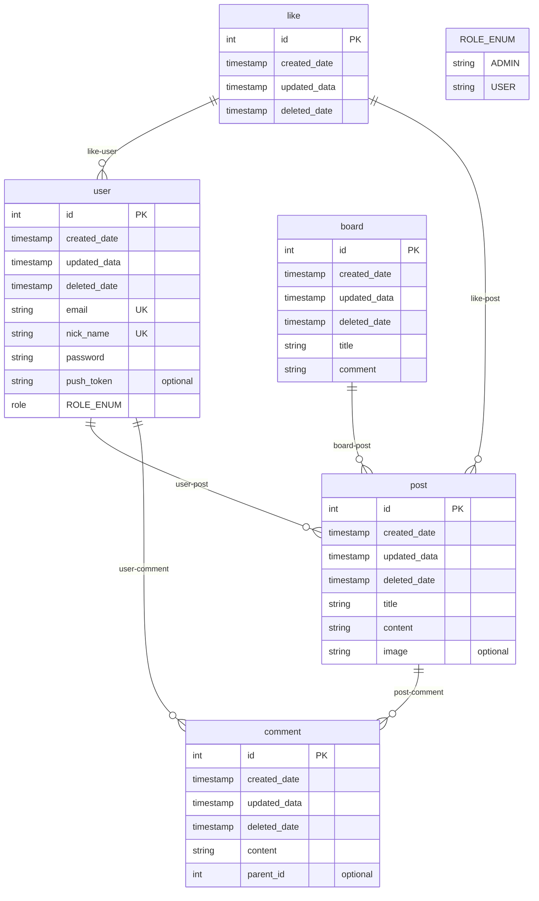

```mermaid
erDiagram
user {
    int id PK
    timestamp created_date
    timestamp updated_data
    timestamp deleted_date
    string email UK 
    string nick_name UK
    string password
    string push_token "optional"
    role ROLE_ENUM
}
post {
    int id PK
    timestamp created_date
    timestamp updated_data
    timestamp deleted_date
    string title
    string content
    string image "optional"
}
board {
    int id PK
    timestamp created_date
    timestamp updated_data
    timestamp deleted_date
    string title
    string comment
}
like {
    int id PK
    timestamp created_date
    timestamp updated_data
    timestamp deleted_date
}
comment {
    int id PK
    timestamp created_date
    timestamp updated_data
    timestamp deleted_date
    string content
    int parent_id "optional"
}
ROLE_ENUM {
    string ADMIN
    string USER
}
user ||--o{ post : user-post
board ||--o{ post : board-post
like ||--o{ user : like-user
like ||--o{ post : like-post
post ||--o{ comment : post-comment
user ||--o{ comment : user-comment
```